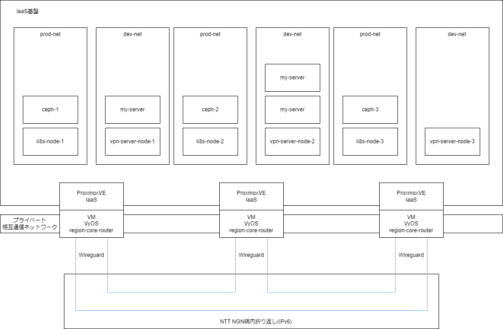
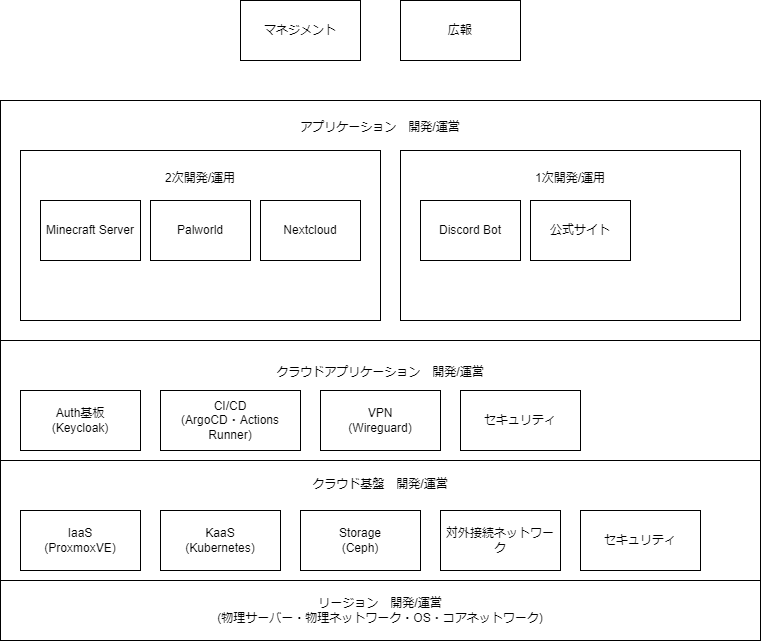

# Network Infrastructure Team新入部員募集

Network Infrastructure Team（以降NI Team）はネットワークコンテンツ研究会のネットワークインフラ開発部門です。
主に「おもしろプライベートクラウド開発プロジェクト NekkoCloud」をはじめとするマルチスタック開発を行います。

<!-- [NekkoCloud Kickoff MTG 資料はこちら][NekkoCloudKickoffMTG] -->
~~NekkoCloud Kickoff MTG 資料はこちら~~

新入部員募集中です。

---

## 応募する

部員、積極募集中です！！
すぐに入部する気がなくても、お気軽にお問い合わせください！
Discord上にて簡単な面談を行います。

~~フォームに必要情報を送信してください。~~  
**X（旧Twitter）にて[部長のアカウント](https://twitter.com/6ftAS)にDMをお願いします。**

---

## サークル・プロジェクト情報

### Network Infrastructure Teamとは？

「Network Infrastructure Team」は千葉工業大学非公式サークル「ネットワークコンテンツ研究会」のマルチスタック開発プロジェクトです。
私たちのチームには、ネットワークやOSの分野に精通した人から、ITについて広く浅く知識を持っている人まで様々なスキルを有した部員がそろっています。
当然、技術力にも差があるため、中々足並みのそろった開発とはいきません。
しかし、はじめは誰だってそうなのです。  
なのでNI Teamでは、ものづくりをおもしろく楽しむことを決して忘れず、各々が自由な姿で開発することを目標にします。
その大きな足掛かりとして、現在取り組んでいるプロジェクトがマルチリージョンクラウドNekkoCloudです。
私たちは、このプラットフォームを足掛かりに、様々なネットワークコンテンツの開発運用に取り組んでいく予定です。

**私たちと一緒にマルチスタックな開発に参加してください！！！**

### 活動場所

基本オンラインでの活動です。
サークルのDiscordサーバー上での活動が主となります。
オンラインイベントや研修会等、必要に応じてリアルでの活動も行います。

### 活動頻度

どのプロジェクトの何を担当するかによって変わります。基本的に自由です。
月に2回程度、企画会議や進捗確認会議を行う予定です。
また、各プロジェクトごとに週1回程度MTGを行います。

---

## 実績

**NIの活躍はこれから。いっしょにおもしろいものを作り上げていきましょう！**

### NI Team at 津田沼祭2023

津田沼祭にて部員のポスター展示及びNekkoCloudのプロトタイプに関する資料展示を行いました。

---

## 募集内容

能力や本人の希望に合わせて、担当タスクを割り振ります。そのため、今は技術力がない人、高い技術力を持つ人、どちらも募集しています。
初学者であってもスキル乖離が起こらないよう、部員がメンターとしてバックアップし、定期的なMTGを行いつつ開発に参加します。

---

## 主な担当箇所

※ プロジェクトの内容によって担当する箇所は変更になります。  
※ 新規プロジェクトの立案や企画は、希望者が行います。  
※ 使用ソフトや技術スタック、歓迎するスキルなどは担当箇所ごとに異なります。また、開発に支障が無ければ各自好きなツールを使用できます。  

### マネジメント

主に現在進行しているプロジェクトの進捗等を管理します。  
※PMがいない場合はチーム内で担当を一人決めて進捗管理をします。

使用ソフト: Nextcloud, ClickUp, Discord  
歓迎するスキル: Project Managimentとしての知見・ノウハウ

- 参考リンク
  - [インシデント対応しながら書くポストモーテム]
  - [Example Postmortem]
  - [SLOは何を実現するのか / What does SLO achieve?]
  - [燃え尽きエンジニアを救う「オンコール最適化、5つの教訓」]

### SRE(Service Reliability Engineering)[^1]

SRE部門の役割は多岐にわたり、NekkoCloudで動作するサービスの可用性、パフォーマンス、監視、CI/CD、プロビジョニング、障害対応...これらすべてを担います。
エンジニア一人ひとりに要求される技術レベルは高く、エンジニアの成熟にも時間がかかります。
しかし、NekkoCloudは部員みんなが自由に使えるプラットフォーム。
お金の心配をせず、自分の勉強のためにリソースを使うことが可能です。  
***最先端のクラウド開発のノウハウを一緒に学び、NekkoCloudをより楽しいモノに変えていく仲間を募集しています。***

主なサービス: NekkoCloud, Proxmox VE  
使用ソフト: Nextcloud, ClickUp, Discord, Draw.io, テキストエディタ  
技術スタック[^3]: Kubernetes, Docker, Terraform, Go, Python, CI/CD, Database, Storage, git  
歓迎するスキル: Linux OS, ネットワークの知識, VMの使用経験, *aaSの使用経験

- 参考リンク
  - [The Site Reliability Workbook: Practical Ways to Implement SRE]
  - [What is Site Reliability Engineering (SRE)?]
  - [このSRE本がすごい！2024年版]
  - [Goでゼロから作る 自作TCP/IPプロトコル サーバー]
  - [Goの初心者が見ると幸せになれる場所]
  - [Kubernetes道場 1日目 - Kubernetesの概要]
  - [【AWS】ぼくのかんがえたさいきょうの運用・監視構成]
  - [Open Source Software Insight]

### ネットワークインフラ

サーバの低レイヤーを担当します。
各リージョンの物理サーバ、物理ネットワーク、OS、コアネットワークといった通信処理機器の運用と改善を行います。
電源喪失時などの非常事態でもNekkoCloudの冗長性を確保し、高可用なプライベートクラウドの運用を目指します。
物理マシンへの知識や経験が何かと重宝されるので、カスタムPCが好きな人や機械いじりが好きな人、あるいはLinuxに詳しい人にオススメな部門です。  
また、NI TeamではNekkoCloudの規模拡大と冗長性確保のため、リージョン参加者を募集しています。
NekkoCloudはマルチリージョンクラウドです。
部員の計算機リソースをみんなで共有することで成り立っています。
オンプレに関心がある方は、是非ご検討よろしくお願いします！

主なサービス: 物理サーバ, 物理ネットワーク, OS, コアネットワーク  
歓迎するリソース[^2]: 計算機リソース（オンプレミス環境）, 光回線  
技術スタック[^3]: Linux OS, C/C++, eBPF, Rust, ネットワークの知識, オンプレに対するロマン, NekkoCloudのリージョンに参加する意欲  

- 参考リンク
  - [低レイヤ技術を間接的に仕事で生かしてきた経験の共有。元Linuxカーネル開発技術者の場合]
  - [オンプレミスとは｜わわわ]
  - [Ethernetのフレーム構造を理解しよう]

### Backend Engineer

ありとあらゆるサービスのバックエンドをサポートします。
システム全体の設計からデプロイまでの工程を担当し、SREチームと連携して運用保守を行います。

主なサービス: NextCloud, Minecreft Server, Palworld Server, Discord Bot, NI Team 紹介サイト  
使用ソフト: Nextcloud, ClickUp, Discord, Draw.io, Figma  
技術スタック[^3]: Docker, Go, JavaScript/TypeScript, Next.js, Python, Java, Kotlin, NGINX, Apache, Database, git  

- 参考リンク
  - [アプリケーション開発におけるフロントエンドとバックエンドの違いは何ですか?]
  - [Goでゼロから作る 自作TCP/IPプロトコル サーバー]
  - [Goの初心者が見ると幸せになれる場所]
  - [怖がらずにサーバーサイドKotlinを使ってみよう]
  - [【初学者必見】TypeScript 完全攻略]
  - [ISUCON公式ブログ]

### Frontend Engineer

NekkoCloudの一次/二次利用を担当します。
Webサイトのデザイン・制作を担当します。
サービスの開発から運用・保守を行い、プロジェクトによってはUX向上を目指した改善を行います。
また、今後の展望として、NekkoCloudを利用したWebアプリの開発を行うことも検討しています。

主なサービス: NI Team 紹介サイト  
使用ソフト: Figma, Draw.io  
技術スタック[^3]: HTML, CSS, JavaScript/TypeScript, React, Next.js, Astro, git

- 参考リンク
  - [アプリケーション開発におけるフロントエンドとバックエンドの違いは何ですか?]
  - [【初学者必見】TypeScript 完全攻略]
  - [ISUCON公式ブログ]

### ~~PE(Platform Engineer)~~

NekkoCloud全体のPlatform Engineeringを担当します。
NekkoCloudからDiscordに至るすべてのプラットフォームのユーザに対して、ベストプラクティスな環境を提案・導入し、新たな価値創造を加速させます。
したがって、PE部門は他の部門との連携が欠かせません。
NI Team全体の開発力を底上げする縁の下の力持ちとして、活躍が期待されます。
まずは、デファクトスタンダードな各種ツールに自分で触れて、似た機能を持つツール同士の比較検証から始めましょう。
そして学んだことはドキュメントにまとめる。
地道な作業ですが、どの部門でも初めは使い方を学ぶところからです。

主なサービス: NekkoCloud, Discord
使用ソフト: Nextcloud, ClickUp, Discord, Draw.io, Figma  
技術スタック[^3]: SREやDevOpsなど最新の開発に関する知見, OSSからプロビジョニングツールなどへの深い知識, git  
歓迎するスキル: GCP/AWSの使用経験, Linux OS, ネットワークの知識

- 参考リンク
  - [プラットフォーム エンジニアリングのキャリアを積むための基盤づくり]
  - [プラットフォームエンジニアリング (Platform Engineering) とは？]
  - [このSRE本がすごい！2024年版]
  - [【AWS】ぼくのかんがえたさいきょうの運用・監視構成]
  - [Open Source Software Insight]

---

## 応募する

部員、積極募集中です！！  
すぐに入部する気がなくても、お気軽にお問い合わせください！  
Discord上にて簡単な面談を行います。

~~フォームに必要情報を送信してください。~~  
**X（旧Twitter）にて[部長のアカウント](https://twitter.com/6ftAS)にDMをお願いします。**

---

## 参考資料

<!-- - [NekkoCloudKickoffMTG] -->
- ~~NekkoCloudKickoffMTG~~
- [Miku's Origin]
- [CIT_VLLab_PR]
- [CIT_VLLab]
- [インシデント対応しながら書くポストモーテム]
- [Example Postmortem]
- [SLOは何を実現するのか / What does SLO achieve?]
- [燃え尽きエンジニアを救う「オンコール最適化、5つの教訓」]
- [プラットフォーム エンジニアリングのキャリアを積むための基盤づくり]
- [プラットフォームエンジニアリング (Platform Engineering) とは？]
- [The Site Reliability Workbook: Practical Ways to Implement SRE]
- [What is Site Reliability Engineering (SRE)?]
- [このSRE本がすごい！2024年版]
- [Kubernetes道場 1日目 - Kubernetesの概要]
- [【AWS】ぼくのかんがえたさいきょうの運用・監視構成]
- [アプリケーション開発におけるフロントエンドとバックエンドの違いは何ですか?]
- [Goでゼロから作る 自作TCP/IPプロトコル サーバー]
- [Goの初心者が見ると幸せになれる場所]
- [怖がらずにサーバーサイドKotlinを使ってみよう]
- [オンプレミスとは｜わわわ]
- [【初学者必見】TypeScript 完全攻略]
- [ISUCON公式ブログ]
- [Open Source Software Insight]
- [低レイヤ技術を間接的に仕事で生かしてきた経験の共有。元Linuxカーネル開発技術者の場合]
- [Ethernetのフレーム構造を理解しよう]

<!--  [NekkoCloudKickoffMTG]: https://github.com/cit-nclab/nekko-cloud/tree/add-project-description -->
[Miku's Origin]: https://mikusorigin.com/
[CIT_VLLab_PR]: https://twitter.com/CIT_VLLab_PR
[CIT_VLLab]: https://twitter.com/CIT_VLLab
[インシデント対応しながら書くポストモーテム]: https://zenn.dev/toshikish/articles/1d5bcf9ed1939d
[Example Postmortem]: https://sre.google/sre-book/example-postmortem/
[SLOは何を実現するのか / What does SLO achieve?]: https://speakerdeck.com/ymotongpoo/what-does-slo-achieve
[燃え尽きエンジニアを救う「オンコール最適化、5つの教訓」]: https://www.pagerduty.co.jp/blog/the-human-side-of-being-on-call-5-lessons-for-managing-stress-anxiety-and-life-while-being-on-call/
[プラットフォーム エンジニアリングのキャリアを積むための基盤づくり]: https://cloud.google.com/blog/ja/products/application-development/how-to-become-a-platform-engineer
[プラットフォームエンジニアリング (Platform Engineering) とは？]: https://zenn.dev/shinyay/articles/what-is-platform-engineering
[The Site Reliability Workbook: Practical Ways to Implement SRE]: https://sre.google/sre-book/table-of-contents/
[What is Site Reliability Engineering (SRE)?]: https://sre.google/
[このSRE本がすごい！2024年版]: https://syu-m-5151.hatenablog.com/entry/2024/01/26/165255
[Kubernetes道場 1日目 - Kubernetesの概要]: https://cstoku.dev/posts/2018/k8sdojo-01/
[【AWS】ぼくのかんがえたさいきょうの運用・監視構成]: https://qiita.com/iStone/items/72417fe599e71e62f631
[アプリケーション開発におけるフロントエンドとバックエンドの違いは何ですか?]: https://aws.amazon.com/jp/compare/the-difference-between-frontend-and-backend/
[Goでゼロから作る 自作TCP/IPプロトコル サーバー]: https://zenn.dev/kawa1214/books/5888c6b3554ffa
[Goの初心者が見ると幸せになれる場所]: https://qiita.com/tenntenn/items/0e33a4959250d1a55045
[怖がらずにサーバーサイドKotlinを使ってみよう]: https://logmi.jp/tech/articles/325121
[オンプレミスとは｜わわわ]: https://wa3.i-3-i.info/word14009.html
[【初学者必見】TypeScript 完全攻略]: https://zenn.dev/kumaaa1212/books/bd5b8edd72ac71
[ISUCON公式ブログ]: https://isucon.net/
[Open Source Software Insight]: https://ossinsight.io/
[低レイヤ技術を間接的に仕事で生かしてきた経験の共有。元Linuxカーネル開発技術者の場合]: https://satoru-takeuchi.hatenablog.com/entry/2023/08/21/222744
[Ethernetのフレーム構造を理解しよう]: https://ascii.jp/elem/000/000/427/427324/

[^1]: SRE(Site Reliability Engineering)が本来の名称です。私たちはIaaSが普及する昨今、数多の会社や開発チームで十人十色のSREを見てきました。そして感じたのは、「SREという概念は肥大化しすぎている」ということです。であるならば、SREという言葉の定義も変化していくべきだと考えました。NI TeamのSRE部門ではSiteに限定せず、すべてのServiceに対してSREを導入していく覚悟で、面白く楽しいクラウド開発を実践しています。
[^2]: NI Teamでは、NekkoCloudを支えるリージョン参加者募集中です。家に余っている計算機リソースを提供して、一緒にNekkoCloudを大きくしていきましょう。
[^3]: ここに書いてある内容は、一人の部員が持っている知識ではなく、このプロジェクトに携わる部員がどれか一つでも持っていれば良いというものです。なので、今はその技術スタックが自分の中に無くても心配は要りません。プロジェクトに合わせて、自分が持ち合わせていない技術スタックも勉強していきましょう。
